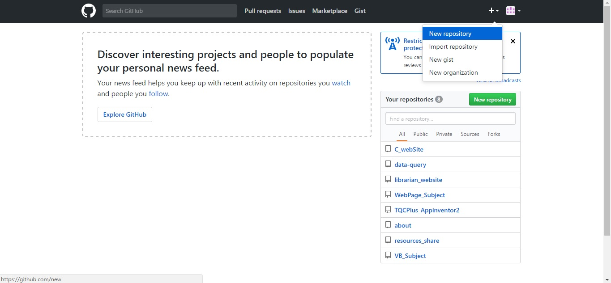
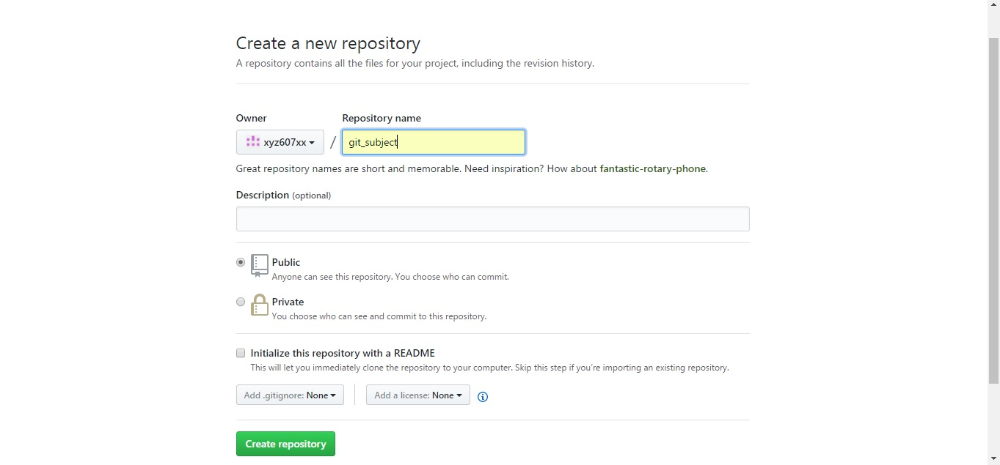
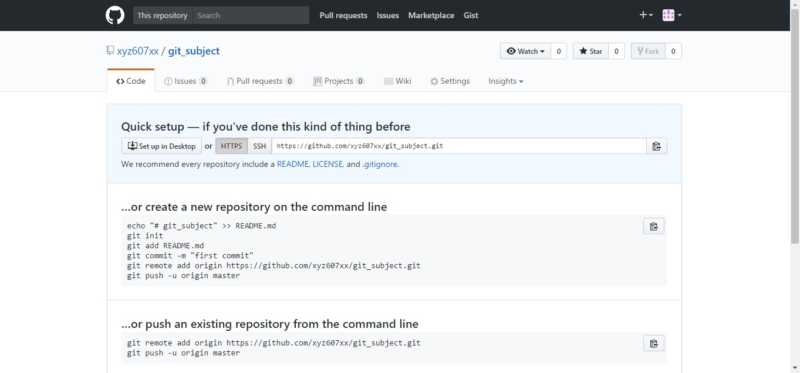

# GitHub註冊及新增repository
## 首先進入github的首頁

### 點選右上角的 sign up 即可註冊
## 登入完成後

### 可以點選右上方的"+"號，點選 New repository 新建一個存儲庫。

### 到這個畫面後輸入 Repository name後 按下create repository 會來到

### 這個畫面，會看到一些git的指令，就可以了。
