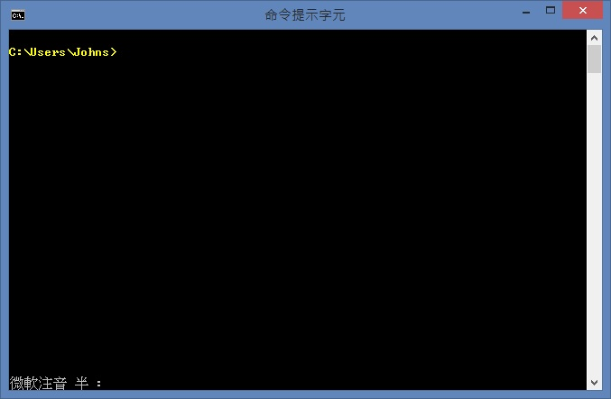
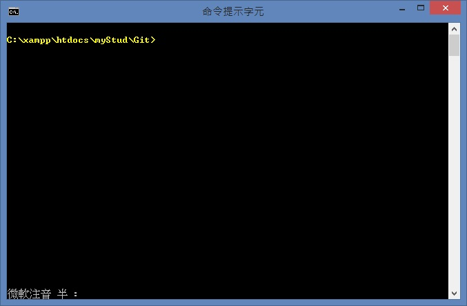
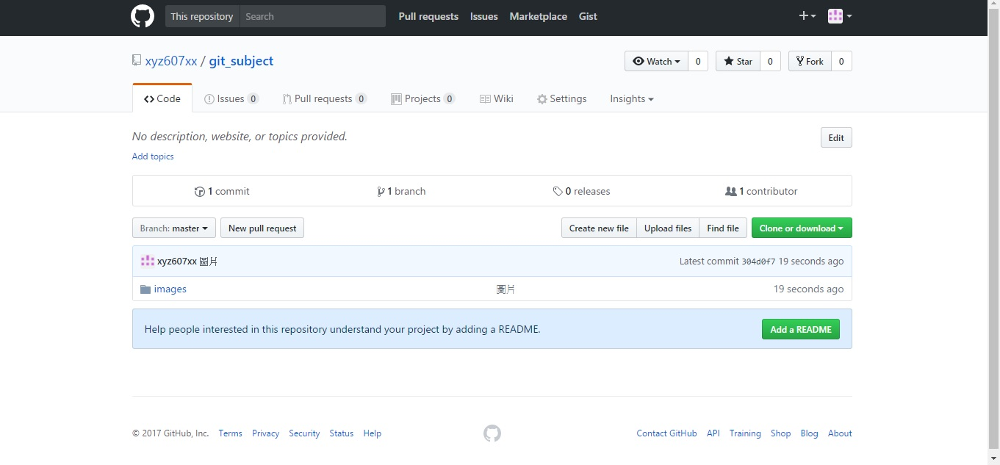

# Git 基本
* ## [安裝完Git](https://github.com/xyz607xx/git_subject/blob/master/git%E5%AE%89%E8%A3%9D.md)
* ## [註冊Github及新增repo](https://github.com/xyz607xx/git_subject/blob/master/github%E8%A8%BB%E5%86%8A.md)
## 做好上述這些事情之後，就可以利用git push code到github上，若環境還沒設好請先設定環境，可以參考上面的連結。
# 開啟cmd

## 先以 cd 切換到要做處理的資料夾
* ### cd.. = 上一層
* ### cd 資料夾名稱 = 移動到某位置
* ### 可使用tab切換檔名
## 假設切換好了

# Git 基本指令
* ## git init = 初始化倉庫
* ## git config --global user.name "使用者帳號" = 設定帳號
* ## git config --global user.email "使用者信箱" = 設定信箱
* ## git remote add origin 加入遠端位置
* ## git add . = 加入所有檔案
* ## git add 檔案名稱 = 加入這個檔案
* ## git commit -m "原因" = 提交的原因
* ## git push origin master = 推送到遠端
* ## git status = 查看git的狀態
## push 第一次可能需要輸入帳號密碼，就輸入就好了。
# push 成功之後
## 之後寫到一個版本就只要
* ## git add 檔名
* ## git commit -m "原因"
* ## git push origin master

# push 失敗?
## 試著使用 pull 與 clone
* ## git pull origin master 
* ## git clone 遠端網址
## clone 可以把遠端的檔案下載下來，再來直接做以下每次都得做的三個步驟就可以了。
# 範例
* ## 切換到目錄
* ## 第一次要做的
* * ## git init
* * ## git config --global user.name "xyz607xx"
* * ## git config --global user.email "xyz607xx@gmail.com"
* * ## git remote add origin https://github.com/xyz607xx/git_subject.git
* ## 每次都得做的
* * ## git add images
* * ## git commit -m "圖片"
* * ## git push origin master
## 會看到以下結果
