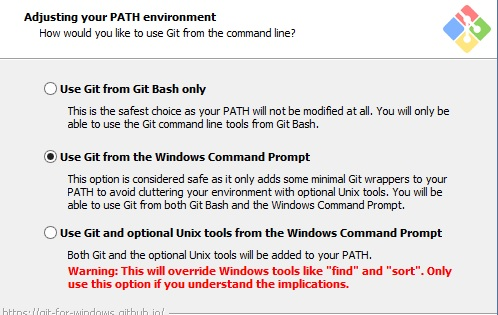
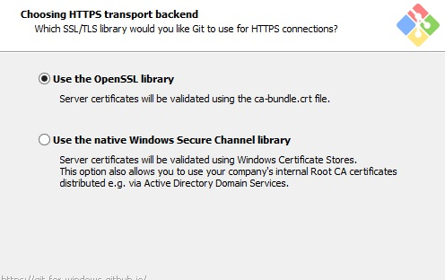
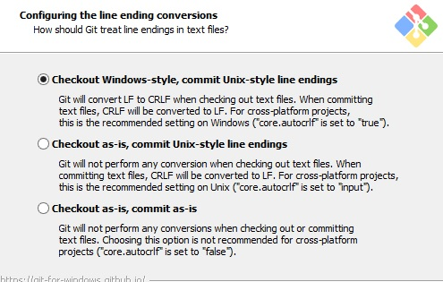
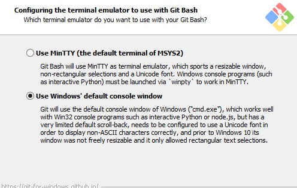

# Git安裝

* ## 安裝Git

## 不管是Windows或是Mac，都可以到Git官方下載

# 安裝過程
## 第一步(調整環境)

### 使用預設的windows command就可以了。
## 第二步

## 第三步

## 第四步

### 這裡選擇windows默認的。
## 安裝完成後，可以在cmd上輸入git verson 如果有出現版本號就是安裝成功了。(安裝完成再開，否則抓不到)
